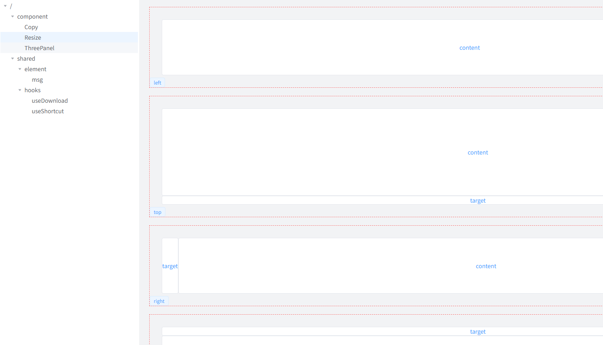

# toolmain

   

frontend development toolkit for "Wage Warrior" within vue environment! it provides a series of useful functions and Vue components.

## Install

```shell
git clone https://github.com/evilArsh/toolmain.git

pnpm i

pnpm dev
```

## 📚 documentation

### npm packages

this repository contains the following packages, you can insstall them one by one

```shell
pnpm add @toolmain/components
pnpm add @toolmain/libs
pnpm add @toolmain/shared
```

you can read each package's `README.md` for more details

[@toolmain/components](./packages/components/README.md)

[@toolmain/libs](./packages/libs/README.md)

[@toolmain/shared](./packages/shared/README.md)

### Router tree

you can overview the components,hooks。the library [localRoute](./packages/libs/README.md) will automatically generate the route tree based on the file structure of the `/playground/src/views` directory. when you want to create a new page, you can only create a new file or directory under `/playground/src/views` rather than writing route configuration manually. nested or simple route was supported.



## 👏 Contributing

Pull requests are welcome

## 📝 License

[MIT](https://choosealicense.com/licenses/mit/)
